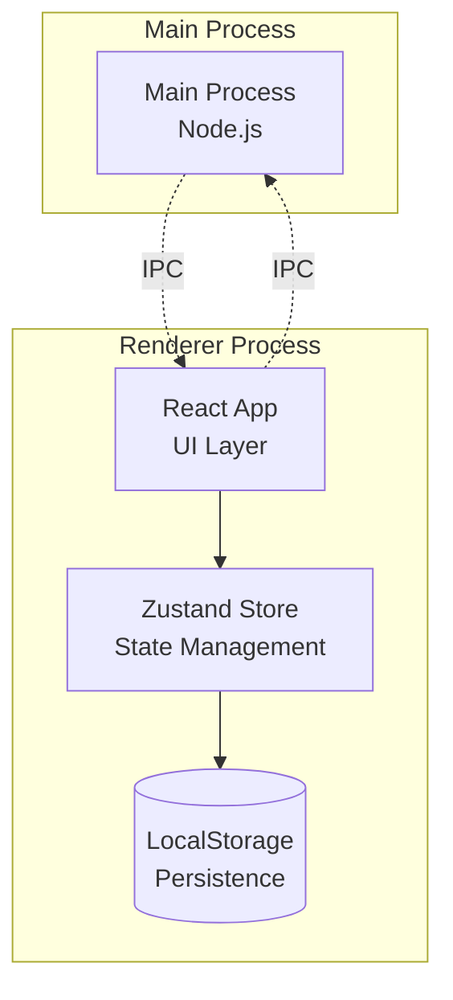

# 📋 Taco - ToDo List Electron App

<div align="center">


**Una aplicación moderna de gestión de tareas con duración temporal**

[](https://opensource.org/licenses/MIT)
[](https://www.typescriptlang.org/)
[](https://www.electronjs.org/)
[](https://reactjs.org/)

[Instalación](#-instalación) • [Uso](#-uso) • [Arquitectura](#-arquitectura) • [Desarrollo](#-desarrollo) • [Contribuir](#-contribuir)

</div>

---

## 🚀 Características

### ✨ Funcionalidades Principales
- **📝 Gestión Completa de Tareas**: Crear, editar, eliminar y reordenar tareas
- **⏱️ Duración Temporal**: Asignar tiempo específico (horas, minutos, segundos) a cada tarea
- **💾 Persistencia Automática**: Guardado automático en almacenamiento local
- **🔄 Reordenamiento**: Mover tareas hacia arriba o abajo en la lista
- **✏️ Edición In-Place**: Modificar tareas existentes sin perder datos
- **🎨 Interfaz Moderna**: Diseño limpio con soporte para tema oscuro/claro

### 🛠️ Características Técnicas
- **🖥️ Multiplataforma**: Windows, macOS y Linux
- **⚡ Rendimiento Optimizado**: Componentes React memoizados y estado eficiente
- **🔒 Seguridad**: Aislamiento de contexto y comunicación IPC segura
- **📱 Responsivo**: Interfaz adaptable a diferentes tamaños
- **🎯 TypeScript**: Tipado estático para mejor calidad de código

---

## 📖 Tabla de Contenidos

- [Instalación](#-instalación)
- [Uso](#-uso)
- [Arquitectura](#-arquitectura)
- [Tecnologías](#-tecnologías)
- [Desarrollo](#-desarrollo)
- [Scripts Disponibles](#-scripts-disponibles)
- [Estructura del Proyecto](#-estructura-del-proyecto)
- [API y IPC](#-api-y-ipc)
- [Contribuir](#-contribuir)
- [Licencia](#-licencia)

---

## 🛠️ Instalación

### Requisitos Previos
```bash
# Node.js (versión 18.0.0 o superior)
node --version

# npm (viene incluido con Node.js)
npm --version

# Git
git --version
```

### Instalación Rápida
```bash
# Clonar el repositorio
git clone https://github.com/Davidshtp/ToDo---List.git

# Navegar al directorio
cd ToDo---List

# Instalar dependencias
npm install

# Ejecutar la aplicación
npm start
```

### Instalación para Desarrollo
```bash
# Instalar dependencias de desarrollo
npm install

# Verificar la instalación
npm run lint

# Ejecutar en modo desarrollo con hot-reload
npm start
```

---

## 🎯 Uso

### Interfaz Principal
La aplicación se divide en dos paneles principales:

#### Panel Izquierdo - Lista de Tareas
- **📋 Vista de Tareas**: Muestra todas las tareas con su duración
- **⚙️ Controles**: Editar, eliminar, reordenar cada tarea
- **📊 Estado Vacío**: Mensaje cuando no hay tareas

#### Panel Derecho - Gestión de Tareas
- **➕ Agregar Tarea**: Formulario para nuevas tareas
- **📝 Título**: Campo de texto para el nombre de la tarea
- **⏱️ Duración**: Campos separados para horas, minutos y segundos
- **✅ Validación**: Verificación de datos en tiempo real

### Flujo de Trabajo Típico

1. **Crear Nueva Tarea**
   ```
   1. Escribir título de la tarea
   2. Establecer duración (HH:MM:SS)
   3. Hacer clic en "Add Task"
   ```

2. **Gestionar Tareas Existentes**
   ```
   • ✏️ Editar: Click en el ícono de lápiz
   • 🗑️ Eliminar: Click en el ícono X
   • ⬆️⬇️ Reordenar: Usar flechas arriba/abajo
   ```

3. **Editar Tarea**
   ```
   1. Click en editar carga los datos en el formulario
   2. Modificar título o duración
   3. Click en "Update Task" para guardar
   ```

### Atajos de Teclado
- **Enter**: Agregar/Actualizar tarea (cuando el formulario está completo)
- **Tab**: Navegar entre campos de duración
- **Esc**: Cancelar edición (funcionalidad futura)

---

## 🏗️ Arquitectura

### Visión General
Taco utiliza una arquitectura **multi-proceso** basada en Electron, separando claramente:



### Componentes Principales

#### 🖥️ Main Process (`src/index.ts`)
- **Responsabilidades**: Gestión de ventanas, eventos del sistema, IPC
- **APIs**: Electron Main APIs, Node.js APIs
- **Comunicación**: IPC con Renderer Process

#### 🎨 Renderer Process (`src/App.tsx`)
- **Responsabilidades**: UI, lógica de negocio, estado local
- **Framework**: React con TypeScript
- **Estado**: Zustand store con persistencia

#### 🔗 IPC Communication
- **Seguridad**: Context Bridge y Preload Scripts
- **Eventos**: `close-app`, `open-child-win`, `tasks-data`

### Flujo de Datos
```
User Input → React Component → Zustand Store → LocalStorage
                ↓
        UI Re-render ← State Change ← Store Update
```

---

## 🚀 Tecnologías

### Frontend Stack
| Tecnología | Versión | Propósito |
|------------|---------|-----------|
| **React** | 19.2.0 | Framework de UI |
| **TypeScript** | 4.5.4 | Tipado estático |
| **Tailwind CSS** | 4.1.16 | Framework CSS |
| **DaisyUI** | 5.3.10 | Componentes UI |
| **Zustand** | 5.0.8 | Estado global |
| **Lucide React** | 0.548.0 | Iconos |

### Desktop & Build
| Tecnología | Versión | Propósito |
|------------|---------|-----------|
| **Electron** | 38.4.0 | Framework desktop |
| **Electron Forge** | 7.10.2 | Build system |
| **Webpack** | 5.x | Bundling |
| **PostCSS** | 8.5.6 | Procesamiento CSS |

### Desarrollo
| Herramienta | Propósito |
|-------------|-----------|
| **ESLint** | Linting de código |
| **TypeScript ESLint** | Reglas específicas de TS |
| **Hot Reload** | Desarrollo rápido |
| **DevTools** | Debugging |

---

## 💻 Desarrollo

### Configuración del Entorno
```bash
# Clonar y configurar
git clone https://github.com/Davidshtp/ToDo---List.git
cd ToDo---List
npm install

# Configurar pre-commit hooks (recomendado)
npx husky install
```

### Desarrollo Local
```bash
# Modo desarrollo con hot-reload
npm start

# En otra terminal - abrir DevTools
# (Se abre automáticamente)
```

### Estructura de Desarrollo
```
src/
├── index.ts              # 🎯 Main process entry
├── App.tsx              # 🎨 React root component  
├── MainComponent.tsx    # 📋 Main UI component
├── shared/              # 🔄 Shared utilities
│   ├── types.ts         # 📝 Type definitions
│   ├── zus-store.ts     # 🗃️ Zustand store
│   ├── functions.ts     # ⚙️ Utility functions
│   └── SharedComponents.tsx # 🧩 Reusable components
└── child-proc/          # 🪟 Child window (future)
```

### Convenciones de Código

#### Nomenclatura
```typescript
// Componentes: PascalCase
const TaskList = () => {}

// Hooks personalizados: camelCase con 'use'
const useMainState = () => {}

// Constantes: SCREAMING_SNAKE_CASE
const MAX_TASK_TITLE_LENGTH = 100

// Funciones: camelCase
const handleAddTask = () => {}
```

#### Estructura de Componentes
```typescript
import React from 'react'
import { useMainState } from './shared/zus-store'
import { TTask } from './shared/types'

interface Props {
  data: TTask
  onEdit: (id: number) => void
}

export const TaskComponent = React.memo<Props>(({ data, onEdit }) => {
  const [localState, setLocalState] = React.useState('')
  
  const handleClick = React.useCallback(() => {
    onEdit(data.id)
  }, [data.id, onEdit])

  return (
    <div>
      {/* JSX */}
    </div>
  )
})
```

---

## 📜 Scripts Disponibles

```bash
# 🚀 Desarrollo
npm start                 # Ejecutar en modo desarrollo
npm run lint             # Linting con ESLint
npm run type-check       # Verificación de tipos

# 📦 Build y Empaquetado
npm run package          # Empaquetar para la plataforma actual
npm run make             # Crear instaladores
npm run make:win         # Crear instalador Windows
npm run make:mac         # Crear instalador macOS  
npm run make:linux       # Crear instalador Linux

# 🔧 Utilidades
npm run clean            # Limpiar archivos de build
npm audit                # Auditoría de seguridad
npm update               # Actualizar dependencias
```

### Scripts Personalizados
```json
{
  "scripts": {
    "dev": "npm start",
    "build:dev": "electron-forge package",
    "build:prod": "electron-forge make",
    "test": "echo \"No tests yet\"",
    "analyze": "npm ls && npm audit"
  }
}
```

---

## 🌐 API y IPC

### Comunicación IPC

#### Main → Renderer
```typescript
// Enviar datos a ventana renderer
mainWindow.webContents.send('tasks-data', taskData)
```

#### Renderer → Main  
```typescript
// Desde preload script
window.electron.close_app()
window.electron.open_child_win(taskData)
```

### Context Bridge API
```typescript
// src/preload.ts
const api = {
  close_app: () => ipcRenderer.send('close-app'),
  open_child_win: (data) => ipcRenderer.send('open-child-win', data)
}

contextBridge.exposeInMainWorld('electron', api)
```

### Estado Global (Zustand)
```typescript
// Estructura del store
interface MainState {
  tasks: TTask[]
  set_state: (key: string, value: any) => void
}

// Uso en componentes
const tasks = useMainState(state => state.tasks)
const set_state = useMainState(state => state.set_state)
```

---

## 🔧 Configuración

### Variables de Entorno
```bash
# .env (si se necesita en el futuro)
NODE_ENV=development
ELECTRON_IS_DEV=true
```

### Configuración de Build
```javascript
// forge.config.ts
const config = {
  packagerConfig: {
    asar: true,
    icon: './assets/icon'
  },
  makers: [
    new MakerSquirrel({}),  // Windows
    new MakerZIP({}, ['darwin']), // macOS
    new MakerDeb({}),      // Linux (Debian)
    new MakerRpm({})       // Linux (Red Hat)
  ]
}
```

---

## 🤝 Contribuir

### Proceso de Contribución
1. **Fork** del repositorio
2. **Crear branch** para tu feature: `git checkout -b feature/amazing-feature`
3. **Commit** tus cambios: `git commit -m 'Add amazing feature'`
4. **Push** al branch: `git push origin feature/amazing-feature`
5. **Abrir Pull Request**

### Guías de Contribución
- ✅ Seguir convenciones de código existentes
- ✅ Agregar tipos TypeScript para nuevas funciones
- ✅ Documentar cambios significativos
- ✅ Probar en múltiples plataformas si es posible

### Reportar Issues
**Antes de reportar:**
- Verificar que no existe un issue similar
- Incluir información del sistema operativo
- Proporcionar pasos para reproducir el problema

---

## 📊 Estado del Proyecto

### ✅ Funcionalidades Completadas
- [x] Gestión CRUD de tareas
- [x] Duración temporal de tareas  
- [x] Persistencia de datos
- [x] Reordenamiento de tareas
- [x] Validación de entrada
- [x] Interfaz responsive
- [x] Arquitectura multi-proceso

### 🚧 En Desarrollo
- [ ] Ventana secundaria funcional
- [ ] Sistema de notificaciones
- [ ] Atajos de teclado avanzados
- [ ] Temas personalizables

### 🔮 Roadmap Futuro
- [ ] Sincronización en la nube
- [ ] Categorías de tareas
- [ ] Recordatorios automáticos
- [ ] Estadísticas de tiempo
- [ ] Exportar/Importar datos
- [ ] Plugin system

---

## 📄 Licencia

Este proyecto está licenciado bajo la **MIT License** - ver el archivo [LICENSE](LICENSE) para más detalles.

```
MIT License

Copyright (c) 2025 Davidshtp

Permission is hereby granted, free of charge, to any person obtaining a copy
of this software and associated documentation files (the "Software"), to deal
in the Software without restriction, including without limitation the rights
to use, copy, modify, merge, publish, distribute, sublicense, and/or sell
copies of the Software...
```

---

## 👥 Autores y Reconocimientos

### Autor Principal
- **[@Davidshtp](https://github.com/Davidshtp)** - *Desarrollo inicial y mantenimiento*
  - Email: davidtrujillo2207@gmail.com

### Reconocimientos
- **Electron Team** - Por el excelente framework
- **React Team** - Por la librería de UI
- **Vercel** - Por Tailwind CSS
- **Comunidad Open Source** - Por las herramientas y librerías utilizadas

---

## 📞 Soporte

### Obtener Ayuda
- 📖 **Documentación**: [docs/](./docs/)
- 🐛 **Issues**: [GitHub Issues](https://github.com/Davidshtp/ToDo---List/issues)
- 💬 **Discusiones**: [GitHub Discussions](https://github.com/Davidshtp/ToDo---List/discussions)

### FAQ
**Q: ¿Cómo cambio el tema oscuro/claro?**
A: Actualmente se detecta automáticamente del sistema. Tema manual en desarrollo.

**Q: ¿Puedo exportar mis tareas?**
A: Funcionalidad planificada para versión futura.

**Q: ¿Funciona offline?**
A: Sí, completamente. Toda la data se guarda localmente.

---

<div align="center">

**⭐ Si te gusta este proyecto, dale una estrella en GitHub ⭐**

[🔝 Volver al inicio](#-taco---todo-list-electron-app)

---

*Desarrollado con ❤️ por [@Davidshtp](https://github.com/Davidshtp)*

</div>